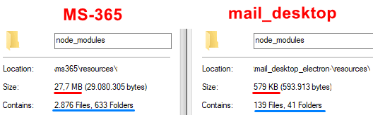
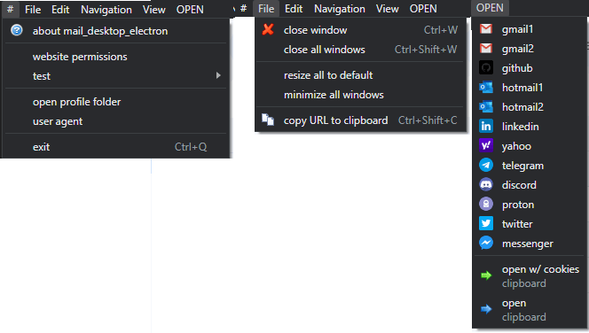
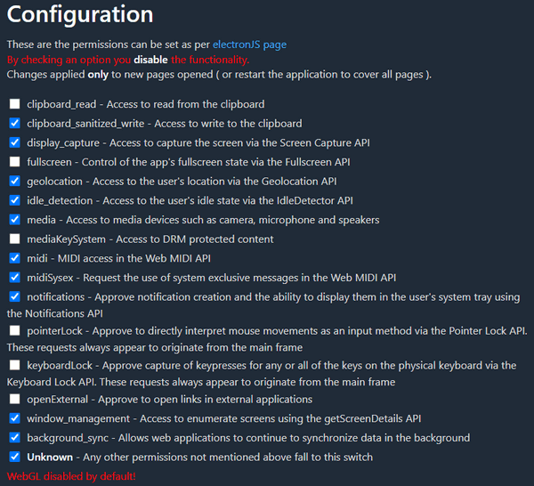
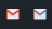

# mail_desktop_electron - keep privacy to mails & messengers

This is the next release of the [.NET mail_desktop](https://github.com/pipiscrew/mail_desktop), made on `ElectronJS`.  

---

The trigger for **ElectronJS edition** was a software found randomly at [Softpedia](https://www.softpedia.com/get/Office-tools/Office-suites/Microsoft-Office-Electron.shtml) & [MS-365 repo](https://github.com/agam778/MS-365-Electron) by `Agampreet Singh`.  

At the beginning, I touch it here and there, never created an `ElectronJS` application. The experience on these three days was `fantastic`! Somehow change my idea for this `heavy` buddy ElectroJS. Saying that because there are many applications just a `hello world` on a `todo` application that the filesize is > 200mb.. And you know coming from DOS era, looks to me a little bit off my style.. Nevertheless, for this type of application (what **mail_desktop** doing), the .NET flavor distro is 73.6mb while the EletronJS one is ~65mb.. Including better experience for the end user...  

In the end, these repo, after del and extend, improve this and that. Does not have any similarities (in code base) with [MS-365 repo](https://github.com/agam778/MS-365-Electron).  

Full credits to `Agampreet Singh`, for his project, without him this repo will be never existed.

---

## list of changes

* remove functionalities & packages (specially the **electron-store** which have reference to https://www.npmjs.com/package/conf - omg!)
* user agent - can defined at `useragent.txt` (near the executable, user has to create it)
* mouse context new options - `save as pdf` & `open in default browser`
* top menu - add multiple sites /playing/ isolated by each other (aka `partitions`)
* top menu - user can open a `custom url` by clipboard to the current `partition`
* top menu - user can set page `permissions`
* prevent multi instances (in case there is no application window and when running the application doing nothing, TERMINATE the process 'mail_desktop_electron'. This happens when previously the app crashed)
* compiled under the traditional [electron-packager](https://github.com/electron/packager)

  

At `releases`, application distributed without [ASAR](https://www.electronjs.org/docs/latest/tutorial/application-distribution) [[2](https://github.com/electron/asar)] [[3](https://www.electronjs.org/docs/latest/tutorial/asar-archives)] package (concatenates all files together without compression) as found there is no need, for this number of files. User is able to modify the js and run flawless without the need of compilation or nodeJS installation.  

---

## screenshots

Enough with the text here is the `main window`  



here is the  `web permissions` take place to all webpages  


* don't forget the [service workers](https://github.com/pipiscrew/small_prjs/tree/master/js_serviceworker), cannot be **disabled** on Chrome.  

---

## description same as .NET
Today I’m thinking, why not creating a tabbed application that is isolated from any other website (each tab has its own cookies) and keep there all the mails / messengers (?).. of course you can use a second browser for that but you have to check it, plus is not providing tab isolation.. This application `stays at tray`, upon mail, getting an `icon` alert… Inspired by [Kiwi for Gmail](https://www.kiwiforgmail.com/) (Kiwi 28/08/2023 turn to Electron).  

Tray icon `alert` vs `normal`  


The icon `alert` can be any of the listed /web applications/ on `OPEN` menu option (first screenshot), when user **left click** the tray icon, the corresponding ElectronJS window will appear!  

---

Was a R&D, for packaging tested :
* (2015) - [electron/packager](https://github.com/electron/packager)
* (2015) - [electron-builder](https://github.com/electron-userland/electron-builder)
* (2018) - [electron-forge](https://github.com/electron-userland/electron-forge)

all in all, the executable that will have your application is by 
> node_modules\electron\dist\electron.exe

what you will choose, depends on your requirements.  

---

### Build the project from source code

when on main folder 

#### electron/packager
```bash
npx electron . #start the app
npx electron-packager . #produce the the so called /compiled exe/
```

#### electron-forge
```bash
npx electron-forge start #start the app
npx electron-forge package #produce the the so called /compiled exe/
```

#### electron-builder
```bash
npx electron . #start the app
npx electron-builder #produce the the so called /compiled exe/
```

moreover, `ElectronJS` team writing : 
> We recommend using Electron Forge  [source](https://www.electronjs.org/docs/latest/tutorial/application-distribution)  

as said 
> what you will choose, depends on your requirements.  

`electron/packager` is my choice.. ;)  


## This project uses the following 3rd-party dependencies :  
* [about-window](https://www.npmjs.com/package/about-window)
* [electron-context-menu](https://www.npmjs.com/package/electron-context-menu)
* [electron-dl](https://www.npmjs.com/package/electron-dl)  

&nbsp;
## links
* [electron.ASAR Integrity](https://www.electronjs.org/docs/latest/tutorial/asar-integrity)
* [electron.Fuses](https://www.electronjs.org/docs/latest/tutorial/fuses)  

&nbsp;
## This project is no longer maintained
Copyright (c) 2024 [PipisCrew](http://pipiscrew.com)  

Licensed under the [MIT license](http://www.opensource.org/licenses/mit-license.php).